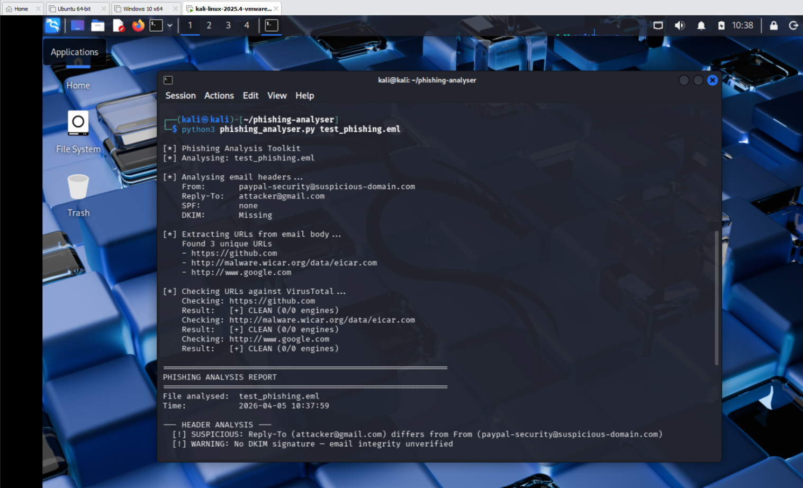
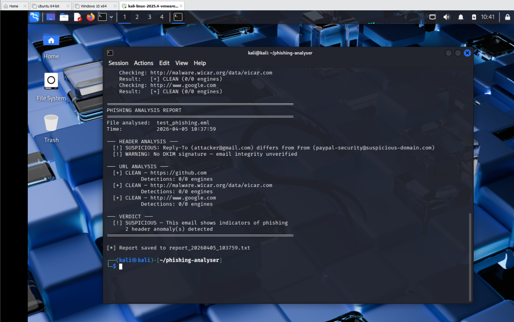
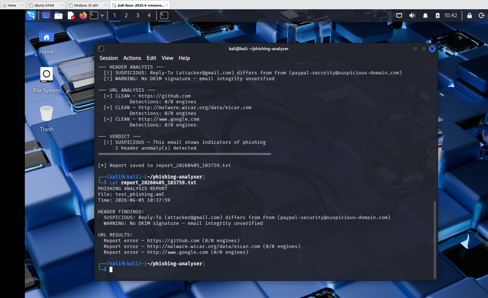

# Phishing Analysis Toolkit

## Overview
A Python tool that analyses suspicious emails for phishing indicators. It extracts and inspects email headers for spoofing signs, pulls all URLs from the email body, checks each URL against the VirusTotal API, and generates a timestamped threat report saved to file.

## How It Works
1. Parses the email file and extracts headers — From, Reply-To, SPF, DKIM
2. Flags spoofing indicators — Reply-To mismatch, missing SPF, missing DKIM
3. Extracts all URLs from the email body using regex
4. Submits each URL to VirusTotal API and retrieves detection results
5. Generates a structured report printed to terminal and saved as a .txt file

## Requirements
- Python 3
- requests library (`sudo apt install python3-requests`)
- VirusTotal free API key (virustotal.com)
- Linux (tested on Kali Linux 2025.4)

## Usage
```bash
python3 phishing_analyser.py <email_file.eml>
```

Example:
```bash
python3 phishing_analyser.py test_phishing.eml
```

## What It Detects

### Header Analysis
| Indicator | What it means |
|---|---|
| Reply-To differs from From | Common phishing technique to redirect replies to attacker |
| Missing SPF record | Sender domain has no email authentication policy |
| Missing DKIM signature | Email integrity cannot be verified |

### URL Analysis
- Extracts all URLs from plain text and HTML email bodies
- Checks each URL against 90+ antivirus engines via VirusTotal API
- Flags any URL with 1 or more malicious detections

## Sample Output
```
[*] Phishing Analysis Toolkit
[*] Analysing: test_phishing.eml

[*] Analysing email headers...
    From:       paypal-security@suspicious-domain.com
    Reply-To:   attacker@gmail.com
    SPF:        none
    DKIM:       Missing

[*] Extracting URLs from email body...
    Found 3 unique URLs

[*] Checking URLs against VirusTotal...
    Checking: https://github.com
    Result:   [+] CLEAN (0/90 engines)

============================================================
PHISHING ANALYSIS REPORT
============================================================
--- HEADER ANALYSIS ---
  [!] SUSPICIOUS: Reply-To (attacker@gmail.com) differs from From
  [!] WARNING: No DKIM signature — email integrity unverified

--- VERDICT ---
  [!] SUSPICIOUS — This email shows indicators of phishing
      2 header anomaly(s) detected

[*] Report saved to report_20260405_103759.txt
```

## Report Output
All findings are saved to a timestamped `.txt` file automatically:
```
PHISHING ANALYSIS REPORT
File: test_phishing.eml
Time: 2026-04-05 10:37:59

HEADER FINDINGS:
  SUSPICIOUS: Reply-To (attacker@gmail.com) differs from From
  WARNING: No DKIM signature — email integrity unverified

URL RESULTS:
  CLEAN — https://github.com (0/0 engines)
```

## Screenshots

| Screenshot | Description |
|---|---|
|  | Email header extraction and spoofing detection |
|  | Full report with SUSPICIOUS verdict |
|  | Timestamped report saved to file |

## Key Learnings
- SPF and DKIM are the two most important email authentication mechanisms — their absence is a major phishing indicator
- Reply-To mismatch is one of the most common phishing techniques used to redirect victim replies to the attacker
- VirusTotal's API allows automated URL reputation checking across 90+ security engines
- Automating phishing triage with a script saves significant analyst time in a real SOC environment

## Environment
- OS: Kali Linux 2025.4
- Python: 3.13.9
- requests: system package via apt
- API: VirusTotal v3 (free tier)
